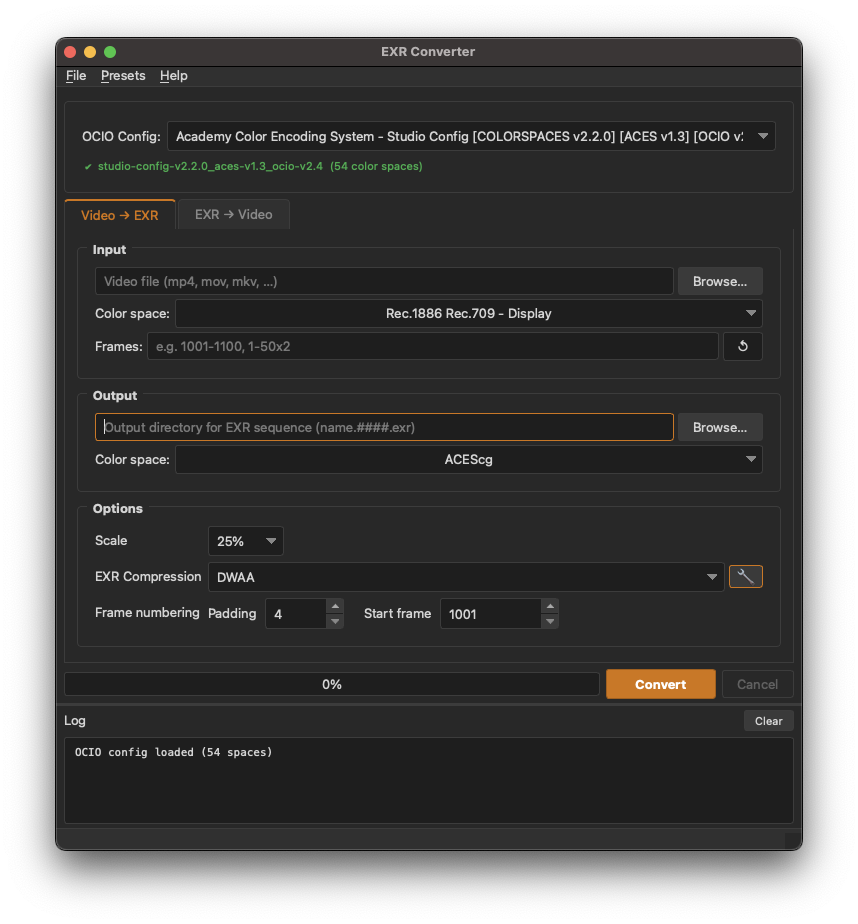

# EXR Converter

Desktop app and CLI for converting between **video** and **OpenEXR** sequences with **OpenColorIO** color management and built-in **slate rendering**. Uses **PyAV** for decode/encode, **OpenImageIO** for EXR I/O, **PySide6** for the GUI, and **Qt WebEngine** for HTML/CSS slate capture.

Targets the [VFX Reference Platform CY2026](https://vfxplatform.com/#reference-platform): Python 3.13, Qt/PySide 6.8, OpenColorIO 2.5, OpenEXR 3.4, NumPy 2.3.

## Downloads

[](https://github.com/derek-rein/vfx-tools/releases)

| Platform | Download |
|----------|----------|
| Windows x64 | [**Installer (.exe)**](https://github.com/derek-rein/vfx-tools/releases/latest/download/exr_converter-windows-x86_64-setup.exe) |
| macOS Apple Silicon | [**DMG**](https://github.com/derek-rein/vfx-tools/releases/latest/download/exr_converter-macos-arm64.dmg) |
| macOS Intel | [**DMG**](https://github.com/derek-rein/vfx-tools/releases/latest/download/exr_converter-macos-x86_64.dmg) |
| Linux x86_64 | [**AppImage**](https://github.com/derek-rein/vfx-tools/releases/latest/download/exr_converter-linux-x86_64.AppImage) |

All release artifacts are [signed with Sigstore Cosign](https://docs.sigstore.dev/) — see the [releases page](https://github.com/derek-rein/vfx-tools/releases) for verification instructions.

## Tech stack

| Layer | Notes |
|-------|--------|
| **Language & tooling** | Python 3.13, [uv](https://docs.astral.sh/uv/) for deps and runs, [Ruff](https://docs.astral.sh/ruff/) in CI, [Nuitka](https://nuitka.net/) for standalone bundles |
| **UI** | [PySide6](https://doc.qt.io/qtforpython/) (Qt 6.8), Nuke-inspired dark theme |
| **Imaging & color** | [OpenImageIO](https://openimageio.org/) (`oiio-python`), [OpenColorIO 2.5](https://opencolorio.org/) for display/render transforms |
| **Video & sequences** | [PyAV](https://github.com/PyAV-Org/PyAV) (FFmpeg bindings) for video I/O, [fileseq](https://github.com/justinfx/fileseq) for frame sequences & ranges |
| **Slate rendering** | Qt **WebEngine** for HTML/CSS slate preview and capture, [Tailwind CSS](https://tailwindcss.com/) in the slate template |

CI runs on **GitHub Actions**; releases publish binaries for Linux, macOS (Apple Silicon + Intel), and Windows.

## Screenshot



## GUI

```bash
uv run python main.py
```

No subcommand — opens the main window. OCIO resolution follows `$OCIO` when set, otherwise built-in configs (see in-app / CLI `--ocio`).

Enable the **Prepend slate** checkbox to add a 1-frame slate image before the converted output.

## CLI

Use the `video2exr` or `exr2video` subcommand.

**Video → EXR**

```bash
uv run python main.py video2exr -i clip.mov -o ./exr_out/
```

**EXR → video**

```bash
uv run python main.py exr2video -i "./plate.####.exr" -o review.mov --fps 24
```

Common options:

| Option | Applies to | Notes |
|--------|------------|--------|
| `--ocio PATH` | both | OCIO config file (overrides `$OCIO`) |
| `--src` / `--dst` | both | OCIO display / scene color space names |
| `--workers N` | both | `0` = auto, `1` = single-threaded |
| `--scale FACTOR` | both | e.g. `0.5` for half resolution |
| `--exr-compression NAME` | `video2exr` | e.g. `dwaa`, `zip`, `none` (see `--help`) |
| `--codec KEY` | `exr2video` | e.g. `prores`, `h264`, `prores_4444`, `dnxhr_hq`, `ffv1` |

Run `uv run python main.py video2exr --help` or `exr2video --help` for the full list.

## Requirements (running from source)

- **Python 3.13**
- [uv](https://docs.astral.sh/uv/) (recommended) or another PEP 621-compatible installer

```bash
git clone https://github.com/derek-rein/vfx-tools.git
cd vfx-tools
uv sync
```

## Building from source

Prerequisites: **Python 3.13**, [**uv**](https://docs.astral.sh/uv/), and a C compiler (Xcode CLT on macOS, MSVC on Windows, gcc on Linux).

```bash
uv sync
make bundle
```

This uses [Nuitka](https://nuitka.net/) to produce a standalone distributable:

| Platform | Output |
|----------|--------|
| macOS | `dist/exr_converter.app` |
| Linux | `dist/exr_converter` (single binary) |
| Windows | `dist\main.dist\` (folder with `exr_converter.exe` + dependencies) |

Nuitka will auto-download `ccache` on first run. See the `Makefile` for the full set of flags.

## Development

| Target | Purpose |
|--------|---------|
| `make run` | Start the GUI |
| `make lint` / `make fmt` | Ruff check / format |
| `make resources` | Regenerate `src/rc_resources.py` from `resources.qrc` (needed after icon changes) |
| `make bundle` | Nuitka standalone bundle under `dist/` |
| `make clean` | Remove all build artifacts |

Icons live under `public/` (`icon.icns` / `icon.ico` / `icon.png`).

## Releases

Tags use plain semver: `v1.2.3`. Pushing a tag runs [`.github/workflows/release.yml`](.github/workflows/release.yml) and publishes a GitHub Release with Linux AppImage, macOS DMGs (ARM64 + Intel), and a Windows installer.

```bash
make help
make release PART=patch        # bump + commit + tag
make release PUSH=1            # … + git push + push tag (triggers CI)
```

CI for lint: [`.github/workflows/ci.yml`](.github/workflows/ci.yml).

## License

MIT — see [`LICENSE`](LICENSE).

[derekvfx.ca](https://derekvfx.ca)
