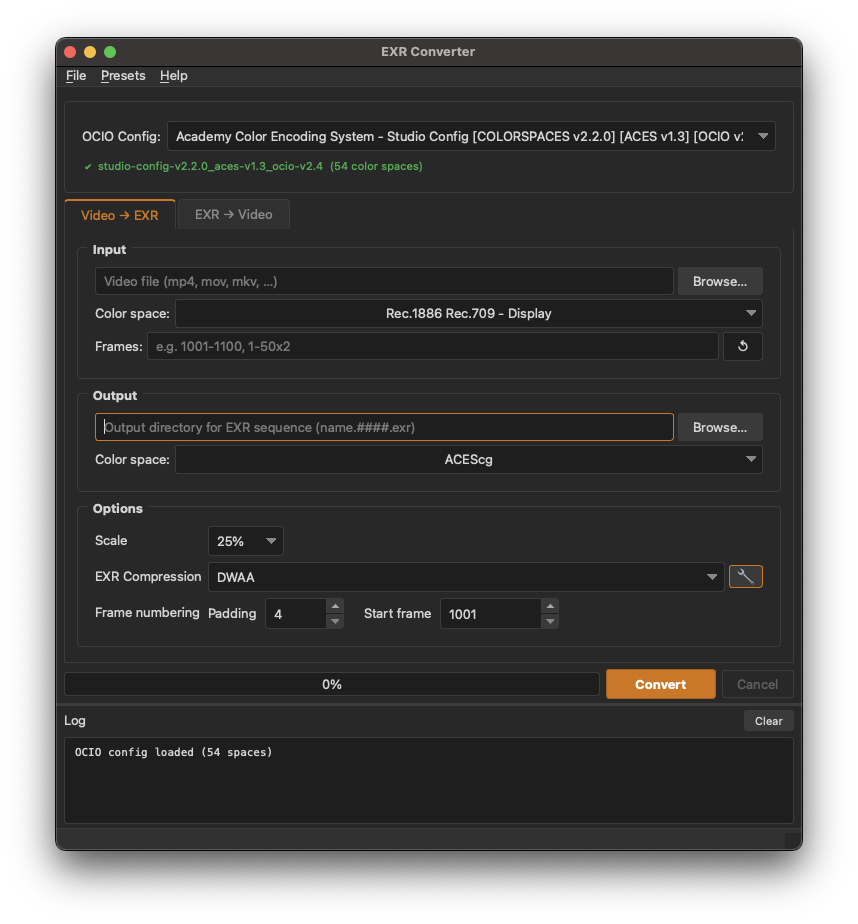

<p align="center">
  
</p>

<h1 align="center">EXR Converter</h1>

<p align="center">
  Desktop app and CLI for <strong>EXR ↔ video</strong> workflows.<br>
  Built for <strong>VFX dailies</strong>, review exports, and plate round-trips, with <strong>OpenColorIO</strong> end to end.
</p>

<p align="center">
  <a href="https://github.com/derek-rein/exr-converter/releases/latest"></a>
  <a href="https://github.com/derek-rein/exr-converter/releases"></a>
  <a href="https://github.com/derek-rein/exr-converter/stargazers"></a>
  <a href="https://github.com/derek-rein/exr-converter/commits/main"></a>
  <a href="https://github.com/derek-rein/exr-converter/actions/workflows/ci.yml"></a>
  <a href="LICENSE"></a>
  <a href="https://github.com/derek-rein/exr-converter/pulls"></a>
</p>

<p align="center">
  <a href="#downloads"></a>
  <a href="#tech-stack"></a>
  <a href="https://opencolorio.org/"></a>
  <a href="https://openexr.com/"></a>
  <a href="#running-on-macos"></a>
</p>

<p align="center">
  <a href="#downloads"><strong>Download</strong></a>
  &nbsp;·&nbsp;
  <a href="#documentation"><strong>Docs</strong></a>
  &nbsp;·&nbsp;
  <a href="#features"><strong>Features</strong></a>
  &nbsp;·&nbsp;
  <a href="#changelog"><strong>Changelog</strong></a>
</p>

## Features

<table>
  <tr>
    <td width="50%" valign="top">
      <strong>Dailies-ready EXR to video</strong><br>
      Prepend a <strong>slate</strong> frame, per-frame <strong>burn-ins</strong> (show, shot, version, and frame tokens), and a <strong>watermark</strong> (tiled text, opacity, size, and angle). Preview overlays live in the slate editor before you encode.
    </td>
    <td width="50%" valign="top">
      <strong>ProRes out of the box</strong><br>
      Full software ladder (Proxy through XQ, default <strong>422 HQ</strong>). <strong>Apple VideoToolbox</strong> on macOS (fast hardware encode; 4444 and XQ are ~12-bit class). Experimental cross-platform RDD-36 presets (<code>prores_ox_*</code>) ship in release builds: 4444 and XQ are true 12-bit; 422 is 12-bit internally and 10-bit to other apps.
    </td>
  </tr>
  <tr>
    <td width="50%" valign="top">
      <strong>Built for speed</strong><br>
      Multi-core <strong>OCIO worker pools</strong> (auto worker count, <code>--workers</code> on the CLI), ordered frame delivery, optional half-res <code>--scale</code>, and GPU OCIO on the built-in player and slate preview hot path.
    </td>
    <td width="50%" valign="top">
      <strong>OCIO your way</strong><br>
      Ships <strong>ACES Studio Config v4</strong> plus extra camera logs (see <a href="#cameras-and-formats">Cameras and formats</a>). Also <code>$OCIO</code>, custom <code>.ocio</code> files, other built-ins, and <strong>local Nuke install configs</strong> (path reference only) from the GUI picker.
    </td>
  </tr>
</table>

### At a glance

| | Video to EXR | EXR to video |
| --- | --- | --- |
| Command | `video2exr` | `exr2video` |
| Input | A video file. Optional `.r3d` / `.nev` or `.braw` when that SDK bridge is built | An image sequence: OpenEXR, DPX, PNG, JPEG, WebP |
| Output | An EXR sequence | ProRes, DNxHR, CineForm, HEVC, H.264, or FFV1 |
| Overlays | Ingest only. Slate, burn-in, and watermark stay on the other tab | Slate, burn-in, and watermark in one pass |
| Color | OCIO into a scene space (default toward `ACEScg` / `scene_linear`) | OCIO out to a display (default toward `Output - Rec.709`) |

**Optional RED R3D / N-RAW:** when built with the official RED R3D SDK bridge, **Video to EXR** can decode `.r3d` and `.nev` (IPP2 primary to Log3G10 REDWideGamutRGB for OCIO), including browser thumbnails, sequence-player preview, and camera/timecode metadata on written EXRs. Release binaries may ship only RED's allowed Redistributable libraries in a private app folder. See [docs/r3d.md](docs/r3d.md) and **Help → About** for the redistributable notice.

**Optional Blackmagic RAW:** when built with the official Blackmagic RAW SDK bridge, **Video to EXR** can decode `.braw` (Linear + ACES AP0 / `ACES2065-1` for OCIO). Without the SDK the extension is recognized but conversion fails with a clear missing-SDK message. Public Release binaries ship the runtime libraries in a private app folder when secret `BRAW_SDK_READ_TOKEN` is configured. See [docs/braw.md](docs/braw.md).

Under the hood: **PyAV** (FFmpeg) for video, **OpenImageIO** for EXR and still sequences (**DPX**, **PNG**, **JPEG**, **WebP**), **PySide6** + **QPainter** for slate and overlays. There is no embedded browser.

Targets the [VFX Reference Platform CY2026](https://vfxplatform.com/#reference-platform): Python 3.13, Qt/PySide 6.8, OpenColorIO 2.5, OpenEXR 3.4, NumPy 2.3.

## Downloads

[](https://github.com/derek-rein/exr-converter/releases)

| Platform | Download |
| --- | --- |
| Windows x64 | [**Installer (.exe)**](https://github.com/derek-rein/exr-converter/releases/latest/download/exr_converter-windows-x86_64-setup.exe) |
| macOS Apple Silicon | [**DMG**](https://github.com/derek-rein/exr-converter/releases/latest/download/exr_converter-macos-arm64.dmg) |
| macOS Intel | [**DMG**](https://github.com/derek-rein/exr-converter/releases/latest/download/exr_converter-macos-x86_64.dmg) |
| Linux x86_64 | [**AppImage**](https://github.com/derek-rein/exr-converter/releases/latest/download/exr_converter-linux-x86_64.AppImage) |

All release artifacts are [signed with Sigstore Cosign](https://docs.sigstore.dev/) and carry [GitHub build provenance attestations](https://docs.github.com/en/actions/security-guides/using-artifact-attestations-to-establish-provenance-for-builds). The [releases page](https://github.com/derek-rein/exr-converter/releases) has the `cosign verify-blob` and `gh attestation verify` commands.

### Running on macOS

The macOS build is signed and notarized, so it opens normally. First launch may still show the standard "downloaded from the internet" prompt.

Release DMGs are signed with a Developer ID Application certificate for **Medeu Global LLC**, then notarized and stapled.

### Install by platform

<details>
<summary><b>macOS</b> (Apple Silicon and Intel)</summary>

#### Install on macOS

| Mac | Download |
| --- | --- |
| Apple Silicon | [exr_converter-macos-arm64.dmg](https://github.com/derek-rein/exr-converter/releases/latest/download/exr_converter-macos-arm64.dmg) |
| Intel | [exr_converter-macos-x86_64.dmg](https://github.com/derek-rein/exr-converter/releases/latest/download/exr_converter-macos-x86_64.dmg) |

The macOS build is signed and notarized, so it opens normally. First launch may still show the standard "downloaded from the internet" prompt.

Open the DMG and drag **EXR Converter** to Applications. The app is `EXR Converter.app`.

```bash
open -a "EXR Converter"
# or the binary directly:
"/Applications/EXR Converter.app/Contents/MacOS/exr_converter" --help
```

</details>

<details>
<summary><b>Windows</b> (x64 installer)</summary>

#### Install on Windows

Download [exr_converter-windows-x86_64-setup.exe](https://github.com/derek-rein/exr-converter/releases/latest/download/exr_converter-windows-x86_64-setup.exe) and run it.

The installer adds a Start menu shortcut and can add a desktop shortcut. The program is `exr_converter.exe`.

</details>

<details>
<summary><b>Linux</b> (x86_64 AppImage)</summary>

#### Install on Linux

Download [exr_converter-linux-x86_64.AppImage](https://github.com/derek-rein/exr-converter/releases/latest/download/exr_converter-linux-x86_64.AppImage).

```bash
chmod +x exr_converter-linux-x86_64.AppImage
./exr_converter-linux-x86_64.AppImage
```

</details>

## Screenshot

<p align="center">
  
</p>

## Quick start

From a source checkout ([requirements](#build-from-source)):

```bash
uv run python main.py
```

No subcommand opens the main window.

```bash
# Video to EXR
uv run python main.py video2exr -i clip.mov -o ./exr_out/

# EXR or image sequence to video
uv run python main.py exr2video -i ./plate -o review.mov --fps 24
```

On **EXR to Video**, check **Prepend slate**, **Burn-in**, and **Watermark** to build review and dailies exports in one pass. The slate editor shows live overlays with GPU OCIO preview. Convert presets remember codec, scale, and color spaces. They leave I/O paths out of the preset.

Packaged apps use the same flags. Per-platform launch commands are in [Install by platform](#install-by-platform). More examples, options, and codec keys are in [CLI](#cli).

## Table of contents

- [Features](#features)
- [Downloads](#downloads)
  - [Running on macOS](#running-on-macos)
  - [Install by platform](#install-by-platform)
- [Screenshot](#screenshot)
- [Quick start](#quick-start)
- [Tech stack](#tech-stack)
  - [Overlay color](#overlay-color)
- [GUI](#gui)
- [Documentation](#documentation)
- [CLI](#cli)
  - [Codecs](#codecs)
  - [CLI examples](#cli-examples)
  - [Convert options](#convert-options)
- [Cameras and formats](#cameras-and-formats)
  - [Camera color spaces](#camera-color-spaces)
- [Build from source](#build-from-source)
  - [Requirements](#requirements)
  - [Bundle](#bundle)
- [Development](#development)
- [Releases](#releases)
  - [Shipping a version](#shipping-a-version)
  - [CI and release gates](#ci-and-release-gates)
- [Changelog](#changelog)
- [License](#license)

## Tech stack

| Layer | Notes |
| --- | --- |
| **Language and tooling** | Python 3.13, [uv](https://docs.astral.sh/uv/) for deps and runs, [Ruff](https://docs.astral.sh/ruff/) in CI, [Nuitka](https://nuitka.net/) for standalone bundles |
| **UI** | [PySide6](https://doc.qt.io/qtforpython/) (Qt 6.8), Nuke-inspired dark theme |
| **Imaging and color** | [OpenImageIO](https://openimageio.org/) (`OpenImageIO` 3.1+), [OpenColorIO 2.5](https://opencolorio.org/). Bundles **ACES Studio Config v4**. Overlay compositing is described below. |
| **Video and sequences** | [PyAV](https://github.com/PyAV-Org/PyAV) (FFmpeg bindings) for video I/O, [fileseq](https://github.com/justinfx/fileseq) for frame sequences and ranges. Optional **RED R3D SDK** bridge for `.r3d` / `.nev`. Optional **Blackmagic RAW SDK** bridge for `.braw`. Optional **oxideav-prores** PyO3 extension (`exr_prores`) for experimental cross-platform RDD-36 ProRes in release builds (4444 and XQ are 12-bit; 422 is 12-bit internal and 10-bit to other apps) |
| **Slate, burn-in, watermark** | Native **QPainter** preview and offscreen capture. Burn-in and watermark are linearised into the working space and alpha-composited per frame, then OCIO-transformed to display before encode |

CI runs on **GitHub Actions** ([`ci.yml`](.github/workflows/ci.yml)). Releases publish binaries for Linux, macOS (Apple Silicon and Intel), and Windows ([`release.yml`](.github/workflows/release.yml)).

<details>
<summary><b>Overlay color</b> (compositing space and the bundled config)</summary>

### Overlay color

Display and render transforms use OpenColorIO 2.5, with a wide-gamut scene-linear **compositing space** for all overlay (slate, burn-in, watermark) compositing. The app prefers **ACES2065-1 (AP0)** via the `aces_interchange` role so sRGB-authored overlays are linearised and alpha-over'd without clipping or shifting the user's footage. It falls back to the `scene_linear` role (for example ACEScg) on non-ACES configs.

The bundled config is **ACES Studio Config v4** from [ASWF OpenColorIO-Config-ACES](https://github.com/AcademySoftwareFoundation/OpenColorIO-Config-ACES) (BSD-3-Clause), with extra camera logs documented in [resources/ocio/CAMERAS.md](resources/ocio/CAMERAS.md). That config includes dozens of camera IDTs, including **Apple Log** (iPhone 15/16 Pro cinematic / ProRes Log), ARRI LogC3/4, RED Log3G10, Sony S-Log3/Venice, Canon Log 2/3 Cinema Gamut, DJI, plus **Nikon N-Log**, **Fujifilm F-Log / F-Log2 / F-Log2 C**, **Leica L-Log**, **Sony S-Log / S-Log2**, Canon Log in Rec.709 and Rec.2020, **KineLOG3**, **GoPro Protune / GP-Log / GP-Log2**, **Blackmagic Film Gen 4**, **OPPO O-Log**, and **Apple Log 2**. Measured error against the published equations and official LUTs is in [resources/ocio/CAMERAS.md](resources/ocio/CAMERAS.md).

</details>

## GUI

```bash
uv run python main.py
```

No subcommand opens the main window. Packaged builds use `exr_converter`, or on macOS:

```bash
"/Applications/EXR Converter.app/Contents/MacOS/exr_converter"
```

**OCIO config picker:** bundled **ACES Studio v4** with the extra camera logs (recommended default), `$OCIO`, custom file, other built-ins, or a **Nuke install config** (your local Foundry OCIO, as a path reference). Source and destination spaces are grouped by family (Input/ARRI, Input/Nikon, Input/Fujifilm, and so on). Override from the CLI with `--ocio PATH` or `--src` / `--dst`.

Camera names on the bundled config are listed under [Cameras and formats](#cameras-and-formats).

## Documentation

Guides live under [`docs/`](docs/) (Markdown source of truth). The public site is built with Hugo from [`site/`](site/) and published to GitHub Pages:

**[https://derek-rein.github.io/exr-converter/](https://derek-rein.github.io/exr-converter/)**

| Guide | |
| --- | --- |
| [CLI](docs/cli.md) | `video2exr` / `exr2video` / GUI launch flags |
| [GUI](docs/gui.md) | Tabs, overlays, preferences, post-convert, codec picker |
| [ProRes and VideoToolbox](docs/prores.md) | Software vs Apple VideoToolbox vs oxideav; honest bit depths |
| [R3D / N-RAW](docs/r3d.md) | Optional RED SDK (license, build, CI, preview) |
| [Blackmagic RAW](docs/braw.md) | Optional BRAW SDK (license, build, Linear ACES AP0; public Releases ship when `BRAW_SDK_READ_TOKEN` is set) |
| [12-bit ProRes (oxideav)](docs/plan-12bit-prores-oxideav.md) | Experimental RDD-36 ProRes; 4444 and XQ are 12-bit, 422 decodes as 10-bit |
| [Nuke](docs/nuke.md) | Menu: open selected Read + session OCIO |

```bash
make docs-serve   # local preview at http://127.0.0.1:1313/
make docs-build   # write site/public/
```

## CLI

**Full reference:** [docs/cli.md](docs/cli.md) · **GUI:** [docs/gui.md](docs/gui.md) · **Nuke:** [docs/nuke.md](docs/nuke.md)

Use the `video2exr` or `exr2video` subcommand to convert, or run with **no** subcommand to open the GUI (optionally with `--open` / `--gui-ocio`).

### Codecs

Default **`prores`** is software **ProRes 422 HQ** (cross-platform, **10-bit** encode). The GUI codec picker is nested by family.

**VideoToolbox** is Apple's **hardware ProRes encoder** on **macOS only** (`prores_videotoolbox` via PyAV). It is faster than software. 422 profiles stay 10-bit. **4444 and XQ keep ~12-bit class** precision that FFmpeg `prores_ks` does not. Full write-up: [docs/prores.md](docs/prores.md).

| Family | Keys | Notes |
| --- | --- | --- |
| **ProRes (software)** | `prores_proxy` … `prores_xq` | FFmpeg `prores_ks`; all profiles encode **10-bit** |
| **ProRes (VideoToolbox)** | `prores_vt_proxy` … `prores_vt_xq` | **macOS only.** Apple hardware encoder. Faster. 4444 and XQ are ~12-bit class |
| **ProRes (oxideav)** | `prores_ox_proxy` … `prores_ox_xq` | Experimental RDD-36 in release builds. **4444 and XQ are true 12-bit.** 422 profiles are 12-bit internal and **10-bit** to FFmpeg, Resolve, and QuickTime |
| **Also** | DNxHR, CineForm, H.264/HEVC, FFV1 | Delivery and lossless options. See [docs/cli.md](docs/cli.md#codecs-honest-bit-depths) |

**Quick picks:** macOS dailies use **`prores_vt_hq`** or **`prores_vt_4444`**. Cross-platform ProRes uses **`prores`**. Cross-platform 12-bit 4:4:4 uses **`prores_ox_4444`** (experimental). Software 4444 and XQ encode **10-bit**.

```bash
uv run python main.py --help
uv run python main.py video2exr --help
uv run python main.py exr2video --help
```

<details>
<summary><b>CLI examples</b></summary>

#### CLI examples

##### Video to EXR

```bash
uv run python main.py video2exr -i clip.mov -o ./exr_out/
```

##### EXR or image sequence to video

```bash
uv run python main.py exr2video -i ./plate -o review.mov --fps 24
# or any frame file from the sequence:
uv run python main.py exr2video -i ./plate/plate.1001.exr -o review.mov --fps 24
# PNG, JPEG, and DPX sequences work the same way:
uv run python main.py exr2video -i ./png_seq -o review.mp4 --codec h264 --fps 24
uv run python main.py exr2video -i ./dpx_seq -o review.mov --fps 24
```

##### GUI with a path pre-loaded

Also used by the Nuke integration.

```bash
uv run python main.py --open ./plate --gui-ocio "$OCIO" --mode exr2video
```

</details>

<details>
<summary><b>Convert options</b></summary>

#### Convert options

| Option | Applies to | Notes |
| --- | --- | --- |
| `--ocio PATH` | both convert commands | OCIO config file (overrides `$OCIO`) |
| `--src` / `--dst` | both | OCIO color space names |
| `--workers N` | both | `0` = auto, `1` = single-threaded |
| `--scale FACTOR` | both | for example `0.5` for half resolution |
| `--exr-compression NAME` | `video2exr` | for example `dwaa`, `zip`, `none` (see `--help`) |
| `--codec KEY` | `exr2video` | ProRes, DNxHR, CineForm, HEVC, H.264, FFV1. See [docs/cli.md](docs/cli.md) for bit-depth notes and codec keys |

</details>

## Cameras and formats

Still sequences on the EXR to video path are **OpenEXR** first, then **DPX**, **PNG**, **JPEG** (`.jpg` / `.jpeg`), and **WebP**. Mixed folders prefer EXR, then DPX. Video I/O goes through PyAV. Optional camera RAW is separate from that list: `.r3d` and `.nev` need the RED bridge, and `.braw` needs the Blackmagic RAW bridge.

<details>
<summary><b>Camera color spaces on the bundled config</b></summary>

### Camera color spaces

Common sources on the bundled ACES Studio v4 config:

- **Apple Log** and **Apple Log 2** (Apple Log covers iPhone 15/16 Pro cinematic / ProRes Log)
- **ARRI LogC3** and **LogC4**
- **Log3G10 REDWideGamutRGB**
- Sony **S-Log3** / **S-Log2** / **S-Log** (including Venice)
- Canon Log 2/3 (Cinema Gamut, Rec.2020, Rec.709) and Canon Log in Rec.709 and Rec.2020
- **Nikon N-Log**
- **Fujifilm F-Log / F-Log2 / F-Log2 C**
- **Leica L-Log**
- **KineLOG3**
- **GoPro Protune / GP-Log / GP-Log2**
- **Blackmagic Film Gen 4**
- **OPPO O-Log**
- **DJI**
- and many more

The extra logs added on top of stock ACES Studio v4, and the measured error against published equations and official LUTs, are in [resources/ocio/CAMERAS.md](resources/ocio/CAMERAS.md).

</details>

## Build from source

Prerequisites: **Python 3.13**, [**uv**](https://docs.astral.sh/uv/) (recommended) or another PEP 621-compatible installer, and a C compiler (Xcode CLT on macOS, MSVC on Windows, gcc on Linux).

<details>
<summary><b>Clone, sync, and bundle</b></summary>

### Requirements

```bash
git clone https://github.com/derek-rein/exr-converter.git
cd exr-converter
make sync   # uv sync + ensure OpenColorIO 2.5+ (see below)
```

> **OpenColorIO 2.5 note:** The bundled ACES Studio config needs OCIO **2.5+**, which comes from the independent `opencolorio` package (not OpenImageIO). If you see *"config is version 2.5... library is not able to load"*, run `make ensure-ocio` (or `make sync`).

### Bundle

```bash
uv sync
make bundle
```

This uses [Nuitka](https://nuitka.net/) to produce a standalone distributable:

| Platform | Output |
| --- | --- |
| macOS | `dist/EXR Converter.app` |
| Linux | `dist/exr_converter` (single binary) |
| Windows | `dist\main.dist\` (folder with `exr_converter.exe` and dependencies) |

Nuitka will auto-download `ccache` on first run. See the `Makefile` for the full set of flags.

</details>

## Development

| Target | Purpose |
| --- | --- |
| `make run` | Start the GUI |
| `make lint` / `make fmt` | Ruff check / format |
| `make test` | Run the pytest suite (unit + integration) |
| `make test-unit` | Unit tests only (skip integration) |
| `make resources` | Regenerate `src/rc_resources.py` from `resources.qrc` (needed after icon changes) |
| `make bundle` | Nuitka standalone bundle under `dist/` |
| `make oxideav-prores` | Build optional PyO3 12-bit ProRes extension (needs Rust and maturin) |
| `make clean` | Remove all build artifacts |

All static assets live under `resources/`: icons in `resources/icons/` (`icon.icns` / `icon.ico` / `icon.png`), UI images in `resources/images/`, the Qt stylesheet at `resources/style.qss`, the bundled OCIO config in `resources/ocio/`, and docs imagery in `resources/screenshots/`.

## Releases

Tags use plain semver: `v1.2.3`. Pushing a tag runs [`.github/workflows/release.yml`](.github/workflows/release.yml) and publishes a GitHub Release with a Linux AppImage, macOS DMGs (ARM64 and Intel), and a Windows installer. After a merge to `main`, [`.github/workflows/auto-tag-release.yml`](.github/workflows/auto-tag-release.yml) can create the missing tag and dispatch that workflow.

| Doc | Contents |
| --- | --- |
| **[CHANGELOG.md](CHANGELOG.md)** | User-facing history (update with every visible change) |
| **[AGENTS.md](AGENTS.md#releasing-and-deployment)** | Full release process: protected `main`, PR, Makefile, `gh`, CI gates |

<details>
<summary><b>Shipping a version</b></summary>

### Shipping a version

```bash
git checkout -b release/X.Y.Z
# Roll CHANGELOG [Unreleased] to [X.Y.Z] first
make release PART=minor PUSH=0   # bump + commit (+ optional local tag; main is PR-only)
git push -u origin HEAD
gh pr create --base main --title "release: X.Y.Z"
# after merge: Auto-tag release pushes vX.Y.Z if missing, then the Release workflow runs
gh run watch
gh release list --limit 5
```

</details>

### CI and release gates

| Workflow | When | Gate |
| --- | --- | --- |
| [CI](.github/workflows/ci.yml) | push / PR to `main` | Ruff + **full pytest suite** (unit + integration) on Linux, macOS, Windows. Aggregate job `ci-ok` is green only if every matrix cell passes. |
| [Release](.github/workflows/release.yml) | tag `v*` | Same lint + full suite must pass (`gate` job) **before** Nuitka builds, Cosign, or the GitHub Release is created. A failing test aborts the release. No artifacts are published. |

Enable **branch protection** on `main` and require the `ci-ok` status check so merges also require a green suite.

## Changelog

User-facing history is in **[CHANGELOG.md](CHANGELOG.md)** (Keep a Changelog, semver). The current release line is also on the [GitHub Releases](https://github.com/derek-rein/exr-converter/releases/latest) page.

## License

MIT. See [`LICENSE`](LICENSE). Copyright Derek Rein.

macOS release DMGs are signed and notarized under **Medeu Global LLC**.

[derekvfx.ca](https://derekvfx.ca)


